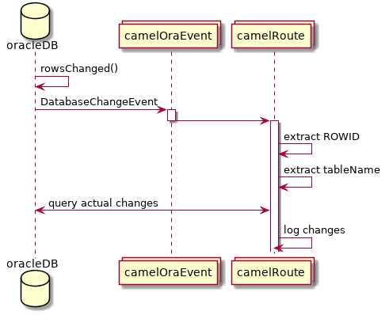

# camel-oraevent-example

Just an example of a camel spring boot using the camel-oraevent component.  In order to see what has changed in the database, we
must go back and query the database based on tableName and ROWID.



Each insert into the database (happening every 5 seconds), should result in output
similar to below.

```
17:30:20.023 [Thread-26] DEBUG o.a.c.c.oraevent.OraEventConsumer - Oracle DatabaseChangeEvent eventType: 7, regId: 901
17:30:20.025 [Thread-26] INFO  pollData - Got NTFDCN: Connection information  : local=192.168.122.1/192.168.122.1:47632, remote=192.168.122.72/192.168.122.72:50418
Registration ID         : 901
Notification version    : 1
Event type              : QUERYCHANGE
Database name           : orcl
Query Change Description (length=1)
  query ID=41, query change event type=QUERYCHANGE
  Table Change Description (length=1):    operation=[INSERT], tableName=FLEX.DEPT, objectNumber=82496
    Row Change Description (length=1):
      ROW:  operation=INSERT, ROWID=AAAUJAAAHAAAATFAAc
17:30:20.039 [Thread-26] INFO  pollData - Row which caused event: [{DEPTNO=2014137545, DNAME=YKtxeJZmlhQM}]
```